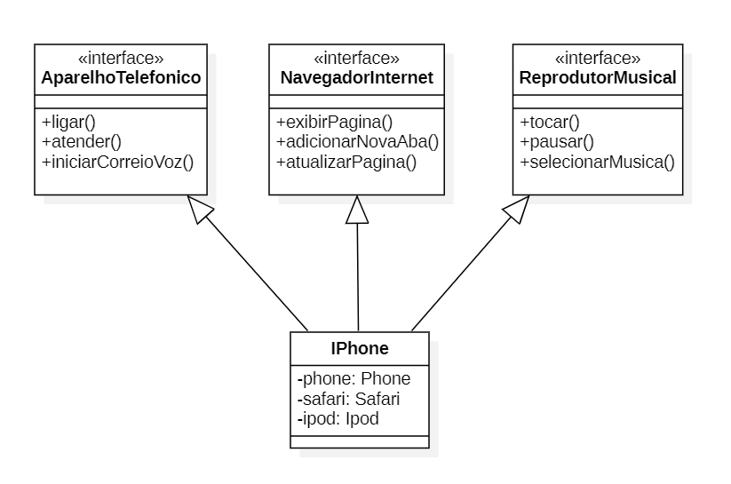

# DIO - Projeto: Orientação a Objetos e UML: Diagramação de Classes do iPhone

Neste modelo de classes, o iPhone é a classe IPhone, que implementa as interfaces _AparelhoTelefonico_, _NavegadorInternet_ e _ReprodutorMusical_, internamente a classe IPhone inicializa três objetos das classes _Phone_, _Safari_ e _Ipod_, onde cada uma implementa sua respectiva interface, adicionando modularidade à classe IPhone.

O diretório [implementacao-iphone/](implementacao-iphone) contém a implementação das classes do diagrama acima, simulando o funcionamento do objeto iphone.

_Nota: O diagrama foi feito utilizando o programa [StarUML v5.1.0](https://staruml.io/)._

---

Este projeto foi descrito em [POO - Desafio](https://github.com/digitalinnovationone/trilha-java-basico/tree/main/desafios/poo).

---

Projeto realizado como parte do [Projeto de UML do Curso de Java](https://web.dio.me/project/desafio-de-projeto-1/learning/6d16483b-8e3c-4275-9e1d-9ecea46a839c) da [DIO](https://web.dio.me).
